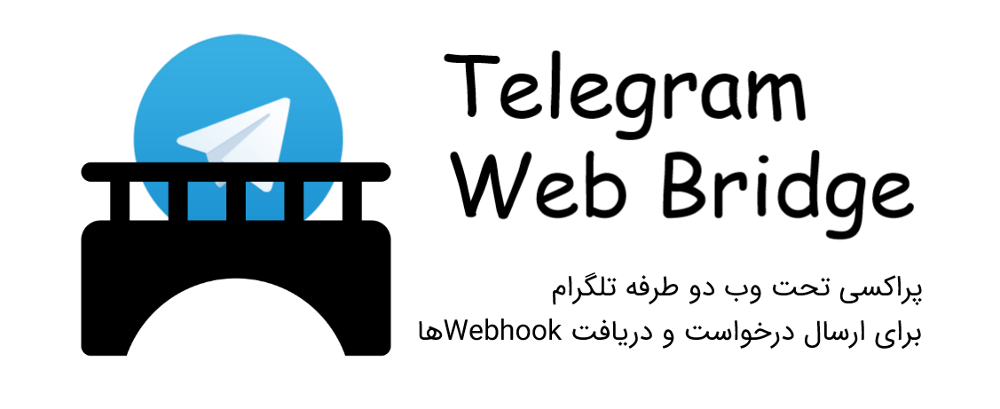
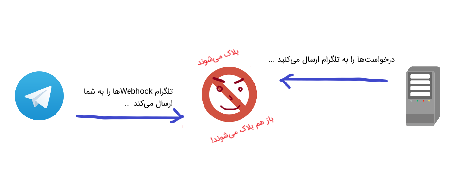
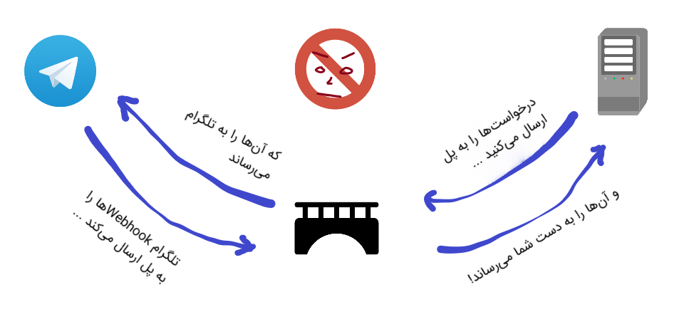

[بازگشت به صفحه انگلیسی](README.md)

## Telegram Web Bridge
[](LICENSE)



> پکیج Telegram Web Bridge یک نرم افزار تحت وب پراکسی مانند است که به عنوان یک رابط بین اپلیکیشن شما و سرورهای تلگرام بصورت دوطرفه عمل می‌کند. این نرم افزار در یک محیط بدون محدودیت قرار گرفته و درخواست‌های ارسالی توسط اپلیکیشن شما به تلگرام را دریافت کرده و آن‌ها را از مسیری بدون محدودیت به تلگرام ارسال خواهد کرد. همچنین این نرم افزار قادر به دریافت Webhookهای تلگرام و تحویل آن به اپلیکیشن شماست.
> این نرم افزار برپایه فریم‌ورک سبک Slim ساخته شده است.

## به چه دردی می‌خورد؟

این نرم افزار در مواقعی می‌تواند کاربردی باشد که دسترسی به سرورهای Telegram Bot API ممکن نباشد (مثلاً زمانی که یک کشور ارتباط با تلگرام را فیلتر یا بلاک می‌کند).



در این شرایط، چنین مشکلاتی پیش خواهد آمد:
* اپلیکیشن اصلی ما قادر به میزبانی در خارج از آن منقطه یا کشور نیست.
* قادر به ارسال درخواست‌ها به Telegram Bot API نیستیم.
* قادر به دریافت Webhookهای تلگرام نیز نیستیم.
* ... اما همچنان به ارتباط با تلگرام نیازمندیم!

اینجاست که این پل نرم افزاری به میان می‌آید. شما می**توانید این پل را در خارج از منطقه میزبانی کنید و از آن برای ارسال و دریافت پیام*های ربات تلگرام استفاده کنید.



### اما راه‌کارهای بسیار دیگری نیز وجود دارد!
بله، برای حل این مشکل راه**کارهای بسیاری وجود دارد اما همه آن*ها قابل پیاده سازی توسط افرادی که کمتر با مسائل فنی آشنا هستند نیست.
این پل نرم افزاری به سادگی قابل پیاده سازی حتی روی هاست‌های اشتراکی نیز است (از آنجایی که بسیار ارزان و به راحتی قابل راه اندازی هستند)! برای استفاده از این نرم افزار، کافی است آن را دانلود کرده، بر روی هاست اشتراکی خود از حالت فشرده خارج کرده و چندین گزینه را تنظیم کنید.

## پیش‌نیازها
این پل نرم افزاری به موارد زیر نیاز دارد:
* یک هاست اشتراکی، سرور مجازی یا سرور اختصاصی.
* PHP نسخه 7 (یا بالاتر) با ماژول `json` فعال شده
* یک گواهی SSL نصب شده که می‌تواند از انواع رایگان Self-signed یا LetsEncrypt باشد. پیشنهاد ما گواهی رایگان LetsEncrypt است چون در چندین کلیک قابل نصب است. اگر گواهی پولی نیز خریداری کرده باشید، مشکلی نیست.

## نصب
می‌توانید نرم افزار را به دو صورت استفاده کنید: یا بسته فشرده با قابلیت پیاده سازی آسان یا دانلود کدهای منبع و ساخت آن.

### بسته فشرده با قابلیت پیاده سازی آسان (پیشنهاد شده برای افراد غیرفنی)
به لینک زیر رفته و آخرین نسخه بسته را دانلود کنید:
[دانلود بسته‌های آماده](https://github.com/AmirrezaNasiri/telegram-web-bridge/releases)  

فایل را بر روی هاست اشتراکی خود، در فضایی قابل دسترس برای عموم آپلود کرده و از حالت فشرده خارج کنید. آدرس (URL)ای که به پوشه بسته اشاره می‌کند، همان `appUrl` شما در فایل تنظیمات خواهد بود.

⛓ برای ادامه، به [بخش بعدی بروید](#configuration).

### دانلود کدها و ساخت بسته (پیشنهاد شده برای افراد فنی)
مخزن را بر روی سرور یا کامپیوتر خود کپی کنید:
```bash
$ git clone https://github.com/AmirrezaNasiri/telegram-web-bridge
```

با استفاده از [Composer](https://getcomposer.org/download/)، وابستگی‌های بسته را نصب کنید:
```bash
$ composer install
```

#### تست کردن
تست‌هایی پایه‌ای برای ارسال درخواست نوشته شده اند اما برای دریافت Webhookها هنوز تستی نوشته نشده است. در تلگرام، یک ربات مخصوص این تست ایجاد کرده و شروع به گفتگو با آن کنید. فایل `tests/settings.php` را باز کرده و به این ترتیب تنظیم کنید:
توکن ربات خود را در فیلد `botApiToken` بنویسید:
```
'botApiToken' => '123456789:aBcdEfghIjklm_nOpqRsTuvWXyZaBcDEFjhi',
```
شناسه کاربری حساب تلگرام خودتان را نیز در فیلد `chatId` قرار دهید:  
شناسه از طریق ربات [@chatid_echo_bot](https://t.me/chatid_echo_bot) قابل استخراج است.
```
'chatId'      => '123456789,
```
و در نهایت تست‌ها را اجرا کنید:
```bash
$ composer test
```

### پیکربندی
تمامی موارد قابل تنظیم در این فایل هستند: `src/settings.php`  
برای شروع به کار، تنها تغییر مقادیر `appUrl`، `crtPath` و `webhookEndpoints` کافی است.

### استفاده از پل نرم افزاری
حالا که همه چیز آماده شده است، کافیست در اپلیکیشن خود، آدرس تمام درخواست‌هایی که به Telegram Bot API فرستاده می‌شود را از مقدار `https://api.telegram.org` به مقداری که در فیلد `appUrl` تنظیمات ذخیره کرده‌اید تغییر دهید.  
برای مثال، درخواست زیر:
```http request
GET https://api.telegram.org/bot123456:ABC-DEF1234ghIkl-zyx57W2v1u123ew11/getMe
```
باید به آدرس زیر تغییر کند:
```http request
GET https://example.com/path-to/telegram-web-hook/bot123456:ABC-DEF1234ghIkl-zyx57W2v1u123ew11/getMe
```
برای دریافت درخواست‌های Webhook از تلگرام نیز کافیست یک بار دیگر متد `setWebhook` را فراخوانی کنید:
```http request
POST https://example.com/path-to/telegram-web-hook/bot123456:ABC-DEF1234ghIkl-zyx57W2v1u123ew11/setWebhook
```
پل نرم افزاری، پارامترهای `url` و `certificate` درخواست شما را به مقادیری که در فایل تنظیمات مشخص کرده‌اید تغییر خواهد داد. بنابراین اگر متد `getWebhookInfo` را اجرا کنید، نتایج با آن چه که در `setWebhook` تنظیم کرده بودید متفاوت خواهد بود.
در زمان ارسال Webhookها توسط تلگرام، این پل نرم افزاری آن‌ها را دریافت کرده و به آدرس مشخص شده در فایل تنظیمات ارسال خواهد کرد.

#### از بسته‌هایی دیگر برای ارسال درخواست‌های ربات استفاده می‌کنید؟
مشکلی نیست. می‌توانید با روش‌های گوناگون آدرس اصلی Telegram Bot API را به پل نرم افزاری خود تغییر دهید. برای برخی از بسته‌ها، راهنمایی‌هایی موجود است:
* [irazasyed/telegram-bot-sdk](https://github.com/irazasyed/telegram-bot-sdk/):  
اگر از این بسته در پروژه لاراول (Laravel) خود استفاده می‌کنید، می‌توانید ببینید که [چگونه BASE_BOT_URL را تغییر دهید](https://github.com/irazasyed/telegram-bot-sdk/issues/632#issuecomment-482867189).

## مشارکت
این پروژه، از مشارکت شما صمیمانه استقبال می‌کند.
* اگر یک خطای امنیتی پیدا کردید، [با من در ارتباط باشید](http://amirreza.in/#page-contact).
* برای هر نوع خطای دیگر، لطفاً [یک issue ایجاد کرده](https://github.com/AmirrezaNasiri/telegram-web-bridge/issues) و برای رفع آن ما را یاری کنید.
* اگر مشکلی را رفع یا قابلیت‌های جدیدی اضافه کردید، [یک Pull Request ایجاد کنید](https://github.com/AmirrezaNasiri/telegram-web-bridge/pulls).

## مجوز نرم افزار
این نرم افزار تحت [مجوز MIT](LICENSE) مورد استفاده قرار می‌گیرد.

## لینک‌های کاربردی
* [Telegram Bot API](https://core.telegram.org/bots/api)
* [ByteGate](https://bytegate.ir/) (وبلاگ ما)