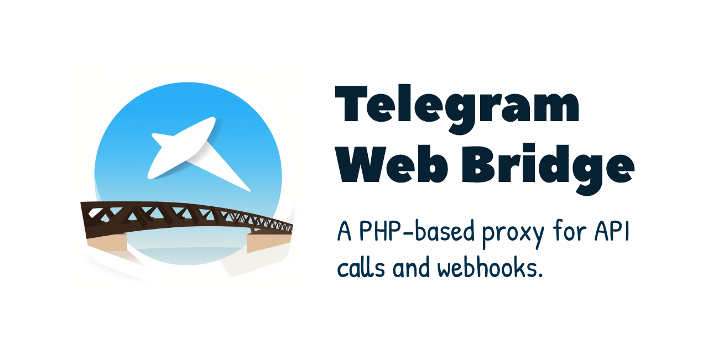
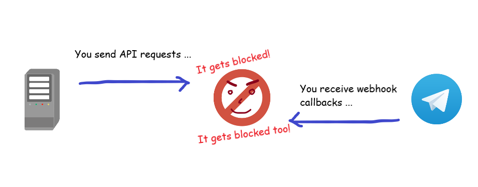
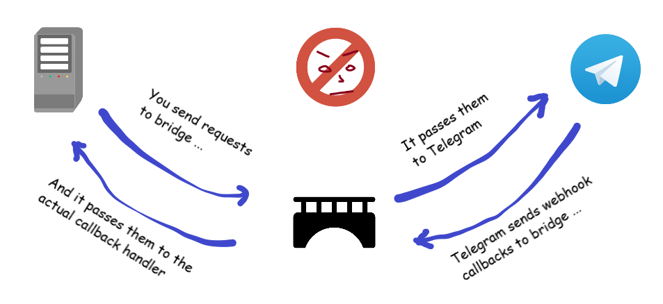

[برای زبان 🇮🇷 فارسی، این صفحه را بخوانید](README.fa-IR.md)

## Telegram Web Bridge
[](LICENSE)



> Telegram Web Bridge is a two-way, web-based, proxy-like application which can act as a middleman for Telegram Bot API requests (from your real application to Telegram) and Webhooks (from Telegram to your real application).   
> Built on [Slim framework](http://www.slimframework.com/), light-weight and works smoothly.

## What is the point?

This bridge can be useful in situations in which accessing Telegram Bot API is not possible (like being hosted in a country resisting/blocking access to Telegram).



Here are the problems come in:  
* We can't host our main application outside that region
* We can't call Telegram Bot API
* We can't receive their webhooks
* ... but we still need Telegram!

Here this bridge comes in. You can host it in outside of the blocking region, use it to call APIs and receive webhooks.



### But there are other solutions too!

Yes, there are plenty of solutions. However, not everyone can implement those solutions without technical knowledge.  
This is a deployment-ready application built to be hosted even on a shared-hosting (since they are pretty cheap) without hassles. Simply download, extract on your shared web hosting, change few settings and done!

## Requirements
The bridge application requires following conditions:
* A shared-hosting, VPS or dedicated server
* PHP version 7 with `json` extension enabled.
* An installed SSL certificate. Can be Self-Signed but LetsEncrypt's free certificates are more hassle-free! If you have paid certificate, it's good too.

## Installation
You can either use deployment-ready archive or clone source code and build for yourself.

### Deployment-ready package (Recommended for non-tech)
Visit following link and download the latest version:  
[Download Builds](https://github.com/AmirrezaNasiri/telegram-web-bridge/releases)  

Unzip the content of the build into a publicly accessible directory on your shared hosting. URL to that directory will be your `appUrl` in settings.  

⛓ [Jump to next section](#configuration) to continue installation.

### Clone Repository (Recommended for advanced users)
Clone repository on your server or local computer:
```bash
$ git clone https://github.com/AmirrezaNasiri/telegram-web-bridge
```

Use [Composer](https://getcomposer.org/download/) to install dependencies:
```bash
$ composer install
```

#### Tests
Basic tests for API calls are available but for webhooks, no tests are written yet.
Create a Telegram Bot for testing purpose and start chatting with it. Open `tests/settings.php` and configurate like this:   
Enter the API token created for test bot:
```
'botApiToken' => '123456789:aBcdEfghIjklm_nOpqRsTuvWXyZaBcDEFjhi',
```
Your account's chat id (can be extracted from [@chatid_echo_bot](https://t.me/chatid_echo_bot)):
```
'chatId'      => '123456789,
```
Then run tests:
```bash
$ composer test
```

### Configuration
All configurable settings are located and described in:
`src/settings.php`

Basically, you only need to change `appUrl`, `crtPath` and `webhookEndpoints` settings.

### Use the bridge!
Now that everything is ready, you just need to change the request URLs from `https://api.telegram.org` to what you've set in your `appUrl`.  
For example, following request
```http request
GET https://api.telegram.org/bot123456:ABC-DEF1234ghIkl-zyx57W2v1u123ew11/getMe
```
Must be changed to:
```http request
GET https://example.com/path-to/telegram-web-hook/bot123456:ABC-DEF1234ghIkl-zyx57W2v1u123ew11/getMe
```

To receive webhook callbacks, you need to fire `setWebhook` once again:
```http request
POST https://example.com/path-to/telegram-web-hook/bot123456:ABC-DEF1234ghIkl-zyx57W2v1u123ew11/setWebhook
```
The bridge will inject its own `url` and `certificate` parameters according to settings you've set. So you should expect result of `getWebhookInfo` to be different than what you've sent in `setWebhook` request.  
On every callback from Telegram, bridge will catch and forward it to the defined URL in the settings file.

#### Using an existence package to send Telegram requests?
No problem. You may be able to easily change target of requests from Telegram's URL to your bridge. Here are tips for several packages:  
* [irazasyed/telegram-bot-sdk](https://github.com/irazasyed/telegram-bot-sdk/):  
If you're using this package in a Laravel projects, see [how to change BASE_BOT_URL](https://github.com/irazasyed/telegram-bot-sdk/issues/632#issuecomment-482867189) to your bridge.

## Contribution 
This project welcomes community contributions.
* Submit security-related bugs to me using [this form](http://amirreza.in/#page-contact).
* [Submit any other kind of bugs](https://github.com/AmirrezaNasiri/telegram-web-bridge/issues) and issues and help us fix them.
* [Submit pull requests](https://github.com/AmirrezaNasiri/telegram-web-bridge/pulls) for bug fixes and features and discuss existing proposals.

## License
Code licensed under the [MIT License](LICENSE).

## Useful Links
* [Telegram Bot API](https://core.telegram.org/bots/api)
* [ByteGate](https://bytegate.ir/) (our blog)